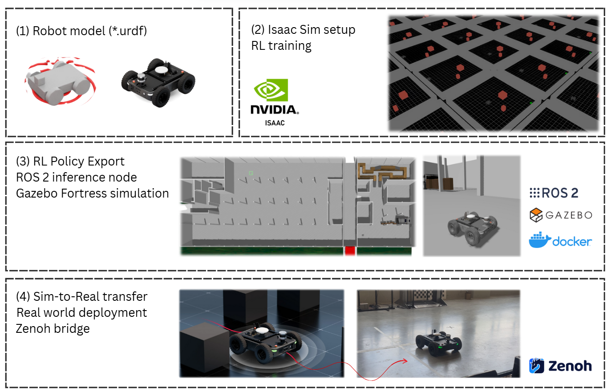
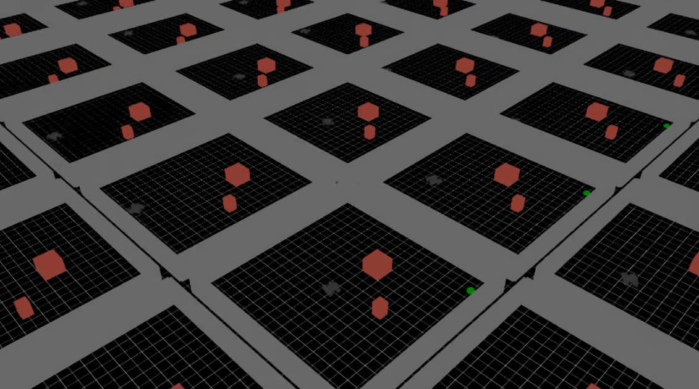

---

# Demonstrating an End-to-End Sim-to-Real Transfer for Lidar-Based Navigation Using Reinforcement Learning

[](https://isaac-sim.github.io/IsaacLab/v2.0.0/)
[](https://docs.isaacsim.omniverse.nvidia.com/latest/index.html)
[](https://docs.python.org/3/whatsnew/3.10.html)
[](https://releases.ubuntu.com/20.04/)

Environments, assets, workflow for open-source mobile robotics, integrated with IsaacLab.

## Table of contents

- [Overview](#overview)
- [Prerequisites](#prerequisites)
- [Installation](#installation)
  - [IsaacSim + IsaacLab](#isaacsim--isaaclab)
  - [Create environment](#create-environment)
  - [Clone repository](#clone-repository)
  - [Pull issue IsaacLab](#pull-issue-isaaclab)
- [Quickstart](#quickstart)
- [Weights and Biases](#weights-and-biases)
- [References](#references)


## Overview


## Prerequisites
- OS: Ubuntu 22.04.5 LTS
- Python: 3.10
- GPU: NVIDIA with CUDA 11.8 or 12.1
- Conda: Miniconda or Anaconda


## Installation

The following subsections explain how to install the environment to run the code. 

### IsaacSim + IsaacLab


```bash
# Create a new environment (env_isaaclab)
conda create -n env_isaaclab python=3.10 -y
# Activate the environment
conda activate env_isaaclab
# Intstall torch or for CUDA 11: `pip install torch==2.5.1 --index-url https://download.pytorch.org/whl/cu118` 
pip install torch==2.5.1 --index-url https://download.pytorch.org/whl/cu121
pip install --upgrade pip
# Install IsaacLab
pip install 'isaacsim[all,extscache]==4.5.0' --extra-index-url https://pypi.nvidia.com

# Install Isaac Lab v2.0.2 
git clone --branch v2.0.2 https://github.com/isaac-sim/IsaacLab.git
cd IsaacLab
./isaaclab.sh -i
```

Source: https://isaac-sim.github.io/IsaacLab/main/source/setup/installation/index.html


### Create environment

```bash
# Go inside the IsaacLab folder
cd <IsaacLab>
# Create a new conda environment
./isaaclab.sh --conda env_isaaclab
# Activate the environment
conda activate env_isaaclab
./isaaclab.sh -i
```

### Clone repository

```bash
# Activate the conda environment
conda activate env_isaaclab
# Clone the repository and install the different avulab python packages
git clone git@github.com:kgulikers/Team_internship_5ARIP10.git
cd Team_internship_5ARIP10/source
pip install -e avulab
pip install -e avulab_tasks
pip install -e avulab_assets
pip install -e avulab_rl
```

### IsaacLab RayCaster pull

Since this project uses the RayCaster sensor, you need to apply an additional pull from GitHub. This pull adds dynamic and multi-mesh support to <mesh_prim_paths> for the RayCaster sensor. See 
[pull request #1886](https://github.com/isaac-sim/IsaacLab/pull/1886)

```bash
# Go to the IsaacLab folder
cd /path/to/IsaacLab
# Fetch the PR into a new branch
git remote add upstream https://github.com/isaac-sim/IsaacLab.git \ || echo "upstream already exists"
git fetch upstream pull/1886/head:pr-1886-raycaster
git checkout pr-1886-raycaster
# Merge into the main branch
git checkout main
git merge pr-1886-raycaster
```

## Quickstart

Training the Origin One can take some hours to achieve good results. 

To start training the Origin One to go from a starting positon to the final goal while avoiding obstacles, use the following command:

```bash
python source/avulab_rl/scripts/train_rl.py --headless -r RSS_NAV_CONFIG
```




## Weights and Biases
To log the different parameters and video's, [Weights & Biases](https://wandb.ai/site/) (`wandb`) is used to record and track training status. Logging to `wandb` is turned on by default. 

## References

### This work

```
@misc{5ARIP10_2025,
  author = {Leliveld, Joost and Muşat, Cristina and Huang, Shao-Ruei and Gulikers, Kevin},
  title  = {Demonstrating an End-to-End Sim-to-Real Transfer for Lidar-Based Navigation Using Reinforcement Learning},
  howpublished = {This repository},
  url = {https://github.com/kgulikers/Team_internship_5ARIP10},  
}
```

### Repository reference

```
@misc{2502.07380,
Author = {Tyler Han and Preet Shah and Sidharth Rajagopal and Yanda Bao and Sanghun Jung and Sidharth Talia and Gabriel Guo and Bryan Xu and Bhaumik Mehta and Emma Romig and Rosario Scalise and Byron Boots},
Title = {Demonstrating avulab: Modern Sim2Real for Low-cost, Open-source Wheeled Robotics},
Year = {2025},
Eprint = {arXiv:2502.07380},
}
```


